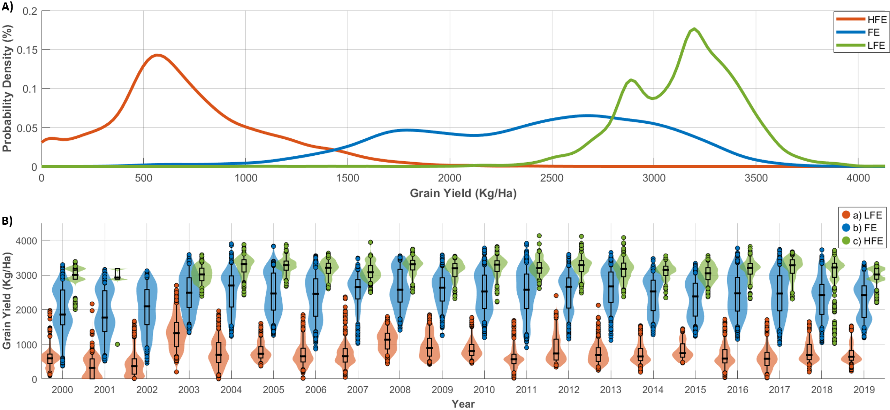
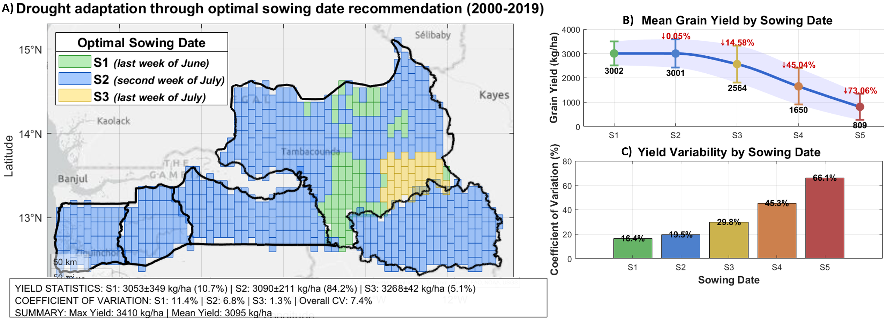

# 🛰️ Drought assessment using earth observation and mechanistic crop modelling

> **3D Dynamic Systems Modeling** | Engineering approach to computational modeling and spatial analysis

---

## 🎯 Research Focus

**Developing GIS approaches to provide drought stress recommendations at crop scale in agricultural systems.** This research integrates spatial analysis with advanced terrain modeling to generate actionable recommendations for management and crop vulnerability mitigation.

---

## 🛰️ Current Work

### **3D Terrain-Based Water Analysis**

*Combining geomorphological terrain data to simulate water redistribution patterns across agricultural landscapes.*

### **Crop Yield at regional scale with CERES-Rice Model** 

*Using remote sensing data and crop modelling to identify crop production.*

---

## 🌾 Drought adaptation strategies through optimal sowing date recommendations

- **Agricultural drought monitoring** using satellite data
- **Landscape-scale vulnerability** assessment  
- **Crop stress prediction** in rainfed systems
- **Early warning systems** for drought-prone areas

---

## 🗺️ GIS Approach

- **Spatial analysis** and terrain modeling
- **Crop-scale assessment** techniques
- **Water flow simulation** and mapping
- **Multi-scale GIS** analysis methods

---

## 🏛️ Research Context

**Research Context:**
- **Agricultural Sciences chapter** of doctoral thesis: *"Crop Modeling to Identify Drought Adaptation Strategies for Rainfed Rice in Drought-Prone Regions"*
- **Agricultural Sciences focus** - Drought vulnerability assessment and crop adaptation

**Applications:**
- Agricultural drought assessment
- Remote sensing methodology development
- Precision agriculture tools
- Climate adaptation planning

---

## 🚀 Installation & Usage

### Requirements
- **MATLAB R2020b or later**
- **Mapping Toolbox** (for terrain analysis)
- **Statistics and Machine Learning Toolbox** (for data analysis)

### Quick Start matlab
% 1. Clone repository
git clone https://github.com/EdgarStevenC/Drought-stress-crop-scale
cd Drought-stress-crop-scale

% 2. Open MATLAB and navigate to repository folder
cd('path/to/Drought-stress-crop-scale')

% 3. Run main simulation
cd('code')
main

% 4. Check output frames
% Results will be saved in 'frames_darcy' folder

---
### Core Functions
- **`initializeTerrain()`** - Creates 3D terrain grid and calculates RPI
- **`initializeWater()`** - Places initial water droplets on terrain
- **`applyGravityAndLateralDiffusion()`** - Physics engine for water movement
- **`visualizeWaterSimple()`** - Real-time water flow visualization

### Example Output
- **3D water flow animations** (GIF format)
- **Runoff index maps** showing terrain-based water redistribution
- **Frame-by-frame analysis** for detailed water movement tracking

## 📊 Associated Data
- **Mendeley Data**: [DOI: 10.17632/fwp748vfkx.1](https://doi.org/10.17632/fwp748vfkx.1)

---

Edgar S. Correa
